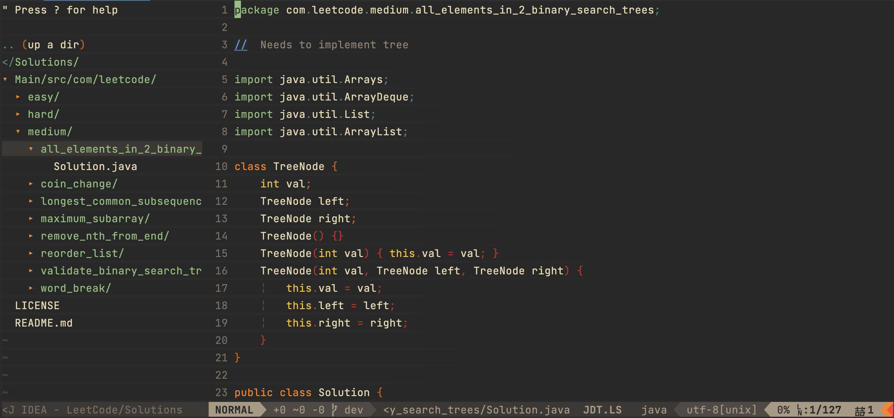

## Solutions to Selected LeetCode Problems in Java

---

- Solved so far (updated regularly)
    + _Easy:_ **61**
    + _Medium:_ **57**
    + _Hard:_ **12**

- Recommended JDK: **Java 17** (unless otherwise noted in the class file)

 

### Source Code Directories

<b>Click to Expand/Collapse</b>

 

 

 Easy (Expand/Collapse) 
 

    Main/src/com/leetcode
    └── easy
        ├── [LC# 67] add_binary [***Grind75-Binary-1/1]
        │   └── Solution.java
        ├── [LC# 844] backspace_string_compare
        │   └── Solution.java
        ├── [LC# 110] balanced_binary_tree [***Grind75-BinaryTree-2/9, +++H-Tree ]
        │   └── Solution.java
        ├── [LC# 121] best_time_to_buy_and_sell_stock [***Grind75-Array-2/11, +++H-Array]
        │   └── Solution.java
        ├── [LC# 704] binary_search [***Grind75-BinarySearch-1/5, +++H-SortingAndSearching]
        │   └── Solution.java
        ├── [LC# 94] binary_tree_inorder_traversal
        │   └── Solution.java
        ├── [LC# 70] climbing_stairs [***Grind75-DP-2/5, +++L-DP]
        │   └── Solution.java
        ├── [LC# 217] contains_duplicate [***Grind75-Array-4/11, +++H-Array]
        │   └── Solution.java
        ├── [LC# 108] convert_sorted_array_to_bst [***G169-BinarySearchTree-2/5, +++H-Tree, +++H-SortingAndSearching]
        │   └── Solution.java
        ├── [LC# 1523] count_odd_nums_in_interval_range
        │   └── Solution.java
        ├── [LC# 338] counting_bits [***G169-Binary-2/7, +++L-Binary]
        │   └── Solution.java
        ├── [LC# 697] degree_of_an_array
        │   └── Solution.class
        ├── [LC# 543] diameter_of_binary_tree [***Grind75-BinaryTree-3/9, +++H-Tree]
        │   └── Solution.java
        ├── [LC# 509] fibonacci_number
        │   └── Solution.class
        ├── [LC# 1991] find_the_middle_index_in_array
        │   └── Solution.java
        ├── [LC# 278] first_bad_version [***Grind75-BinarySearch-2/5, +++H-SortingAndSearching]
        │   └── Solution.java
        ├── [LC# 733] flood_fill [***Grind75-Graph-1/10, +++H-Graph]
        │   └── Solution.java
        ├── [LC# 202] happy_number
        │   └── Solution.java
        ├── [LC# 232] implement_queue_using_stacks [***Grind75-Stack-2/7, +++M-Stack]
        │   └── Solution.java
        ├── [LC# 160] intersection_of_two_linked_lists
        │   └── Solution.java
        ├── [LC# 226] invert_binary_tree [***Grind75-BinaryTree-1/9, +++H-Tree]
        │   └── Solution.java
        ├── [LC# 703] kth_largest_element_in_a_stream
        │   └── Solution.java
        ├── [LC# 1046] last_stone_weight
        │   └── Solution.java
        ├── [LC# 141] linked_list_cycle [***Grind75-LinkedList-2/5, +++M-LinkedList]
        │   └── Solution.java
        ├── [LC# 14] longest_common_prefix
        │   └── Solution.java
        ├── [LC# 409] longest_palindrome [***Grind75-String-3/8]
        │   └── Solution.java
        ├── [LC# 235] lowest_common_ancestor_of_a_bst [***Grind75-BinaryTree-6/9, +++H-Tree]
        │   └── Solution.java
        ├── [LC# 169] majority_element [***Grind75-Array-3/11]
        │   └── Solution.java
        ├── [LC# 104] maximum_depth_of_binary_tree [***Grind75-BinaryTree-4/9, +++H-Tree]
        │   └── Solution.java
        ├── [LC# 252] meeting_rooms [###G169-Array-5/24, +++H-Array]
        │   └── Solution.java
        ├── [LC# 21] merge_two_sorted_lists [***Grind75-LinkedList-1/5, +++M-LinkedList]
        │   └── Solution.java
        ├── [LC# 876] middle_node [***Grind75-LinkedList-4/5]
        │   └── Solution.java
        ├── [LC# 2383] min_hrs_of_train_to_win_comp
        │   └── Solution.java
        ├── [LC# 746] minimum_cost_climbing_stairs
        │   └── Solution.java
        ├── [LC# 268] missing_number [***G169-Binary-5/7, +++L-Binary]
        │   └── Solution.java
        ├── [LC# 283] move_zeroes
        │   └── Solution.java
        ├── [LC# 191] number_of_1_bits [***G169-Binary-3/7, +++L-Binary]
        │   └── Solution.java
        ├── [LC# 234] palindrome_linked_list [###G169-LinkedList-5/14]
        │   └── Solution.java
        ├── [LC# 09] palindrome_number [###G169-Math-2/5]
        │   └── Solution.class
        ├── [LC# 66] plus_one
        │   └── Solution.java
        ├── [LC# 383] ransom_note [+++M-HashTable]
        │   └── Solution.java
        ├── [LC# 1047] remove_all_adjacent_duplicates_in_string
        │   └── Solution.class
        ├── [LC# 26] remove_duplicates_from_sorted_array
        │   └── Solution.java
        ├── [LC# 27] remove_element
        │   └── Solution.java
        ├── [LC# 1119] remove_vowels_from_a_string
        │   └── Solution.java
        ├── [LC# 190] reverse_bits [***G169-Binary-6/7, +++L-Binary]
        │   └── Solution.java
        ├── [LC# 206] reverse_linked_list [***Grind75-LinkedList-3/5, +++M-LinkedList]
        │   └── Solution.java
        ├── [LC# 344] reverse_string
        │   └── Solution.class
        ├── [LC# 13] roman_to_integer [###G169-Math-1/5]
        │   └── Solution.java
        ├── [LC# 100] same_tree [+++H-Tree]
        │   └── Solution.java
        ├── [LC# 35] search_insert_position
        │   └── Solution.java
        ├── [LC# 136] single_number [***G169-Binary-4/7, +++L-Binary]
        │   └── Solution.java
        ├── [LC# 1356] sort_integers_by_the_number_of_1_bits [+++L-Binary]
        │   └── Solution.class
        ├── [LC# 977] squares_of_a_sorted_array [###G169-Math-7/24, +++H-Array, P-2_Pointers]
        │   └── Solution.java
        ├── [LC# 572] subtree_of_another_tree [+++H-Tree]
        │   └── Solution.java
        ├── [LC# 101] symmetric_tree
        │   └── Solution.java
        ├── [LC# 2432] the_employee_that_worked_on_the_longest_task [+++H-Array]
        │   └── Solution.java
        ├── [LC# 01] two_sum [***Grind75-Array-1/11, +++H-Array, +++M-HashTable]
        │   └── Solution.java
        ├── [LC# 653] two_sum_iv_input_is_a_bst [+++H-Tree, +++M-Recursion, +++M-HashTable]
        │   ├── Solution.java
        ├── [LC# 242] valid_anagram [***Grind75-String-2/8]
        │   └── Solution.java
        ├── [LC# 125] valid_palindrome [***Grind75-String-1/8]
        │   └── Solution.java
        └── [LC# 20] valid_parentheses [***Grind75-Stack-1/7, +++M-Stack]
            └── Solution.java

 

 Medium (Expand/Collapse) 
 

    Main/src/com/leetcode
    └── medium
        ├── [LC# 721] accounts_merge [***Grind75-Graph-7/10, +++H-Graph, +++H-Union-Find-or-Disjoint-Set]
        │   └── Solution.java
        ├── [LC# 1305] all_elements_in_2_binary_search_trees
        │   └── Solution.java [***Grind75-Graph-6/10, +++H-Graph, +++L-DP, P-GraphBFS]
        ├── [LC# 102] binary_tree_level_order_traversal [***Grind75-BinaryTree-5/9, +++H-BinaryTree, P-Tree-BFS]
        │   └── Solution.java
        ├── [LC# 199] binary_tree_right_side_view [***Grind75-BinaryTree-7/9, +++H-BinaryTree, +++M-Recursion]
        │   └── Solution.java
        ├── [LC# 133] clone_graph [***Grind75-Graph-3/10, +++H-Graph, P-BFS]
        │   └── Solution.java
        ├── [LC# 322] coin_change [***Grind75-DP-3/5, +++L-DP]
        │   └── Solution.java
        ├── [LC# 39] combination_sum [***Grind75-Array-8/11, +++H-Array, P-Backtracking]
        │   └── Solution.java
        ├── [LC# 105] construct_binary_tree_from_preorder_and_inorder_traversal [***Grind75-BinaryTree-8/9, +++H-Tree]
        │   └── Solution.java
        ├── [LC# 11] container_with_most_water [***Grind75-Array-11/11, +++H-Array, P-2_Pointers]
        │   └── Solution.java
        ├── [LC# 207] course_schedule [***Grind75-Graph-4/10, +++H-Graph, P-Topological_Sort]
        │   └── Solution.java
        ├── [LC# 362] design_hit_counter [###G169-Queue-1/1]
        │   └── HitCounter.java
        ├── [LC# 150] evaluate_reverse_polish_notation [***Grind75-Stack-3/7, +++M-Stack]
        │   └── Solution.java
        ├── [LC# 438] find_all_anagrams_in_a_string [***Grind75-String-7/8, +++H-String]
        │   └── Solution.java
        ├── [LC# 442] find_all_duplicates_in_an_array [P-Cyclic_Sort]
        │   └── Solution.java
        ├── [LC# 287] find_the_duplicate_number [***G169-Binary-7/7, +++L-Binary]
        │   └── Solution.java
        ├── [LC# 134] gas_station
        │   └── Solution.java
        ├── [LC# 49] group_anagrams [+++H-String, +++M-HashTable]
        │   └── Solution.java
        ├── [LC# 208] implement_trie_prefix_tree [***Grind75-Trie-1/2, +++M-Trie]
        │   └── Trie.java
        ├── [LC# 57] insert_interval [***Grind75-Array-5/11, +++H-Array]
        │   └── Solution.java
        ├── [LC# 973] k_closest_point_to_origin [***Grind75-Heap-1/4, +++M-Heap]
        │   └── Solution.java
        ├── [LC# 230] kth_smallest_element_in_a_bst [***Grind75-BinarySearchTree-3/3, +++H-Tree]
        │   └── Solution.java
        ├── [LC# 17] letter_combinations_of_a_phone_no [***Grind75-Recursion-3/3, +++M-Recursion]
        │   └── Solution.java
        ├── [LC# 1143] longest_common_subsequence [+++L-DP]
        │   └── Solution.java
        ├── [LC# 5] longest_palindromic_substring [***Grind75-String-6/8, +++H-String]
        │   └── Solution.java
        ├── [LC# 3] longest_substring_without_repeating [***Grind75-String-4/8, +++H-String]
        │   └── Solution.class
        ├── [LC# 236] lowest_common_ancestor_of_a_binary_tree [***Grind75-BinaryTree-5/9, +++H-BinaryTree]
        │   └── Solution.java
        ├── [LC# 146] lru_cache [***Grind75-LinkedList-5/5, +++M-LinkedList]
        │   └── Solution.java
        ├── [LC# 53] maximum_subarray [***Grind75-DP-1/5, +++H-Array]
        │   └── Solution.java
        ├── [LC# 56] merge_intervals [***Grind75-Array-9/11, +++M-Interval]
        │   └── Solution.java
        ├── [LC# 155] min_stack [***Grind75-Stack-4/7, +++M-Stack]
        │   └── Solution.java
        ├── [LC# 310] minimum_height_trees [***Grind75-Graph-9/10, +++H-Graph, P-Topological_Sort, P-Tree-BFS]
        │   └── Solution.java
        ├── [LC# 200] number_of_islands [***Grind75-Graph-5/10, +++H-Graph, P-Islands]
        │   └── Solution.java
        ├── [LC# 416] partition_equal_subset_sum [***Grind75-DP-4/5, +++L-DP]
        │   └── Solution.java
        ├── [LC# 46] permutations [***Grind75-Recursion-1/3, +++M-Recursion]
        │   └── Solution.java
        ├── [LC# 238] product_of_array_except_self [***Grind75-Array-7/11, +++H-Array]
        │   └── Solution.java
        ├── [LC# 1209] remove_all_adjacent_duplicates_in_string_ii
        │   └── Solution.class
        ├── [LC# 316] remove_duplicate_letters
        │   └── Solution.java
        ├── [LC# 80] remove_duplicates_from_sorted_array_ii
        │   └── Solution.java
        ├── [LC# 19] remove_nth_from_end_of_list [###G169-LinkedList-7/14, +++M-LinkedList] 
        │   └── Solution.java
        ├── [LC# 143] reorder_list [###G169-LinkedList-12/14, +++M-LinkedList]
        │   └── Solution.java
        ├── [LC# 7] reverse_integer [###G169-Math-5/5]
        │   └── Solution.java
        ├── [LC# 994] rotting_oranges [***Grind75-Graph-6/10, +++H-Graph, +++L-DP, P-GraphBFS]
        │   └── Solution.java
        ├── [LC# 33] search_in_rotated_sorted_array [***Grind75-BinarySearch-3/5, +++H-SortingAndSearching, P-Modified-BinarySearch]
        │   └── Solution.java
        ├── [LC# 449] serialize_and_deserialize_bst
        │   └── Solution.java
        ├── [LC# 71] simplify_path
        │   └── Solution.java
        ├── [LC# 75] sort_colors [***Grind75-Array-10/11, +++H-Array, P-2_Pointers]
        │   └── Solution.java
        ├── [LC# 54] spiral_matrix [***Grind75-Matrix-1/1, +++H-Matrix]
        │   └── Solution.java
        ├── [LC# 8] string_to_integer_atoi [***Grind75-String-5/8]
        │   └── Solution.java
        ├── [LC# 78] subsets [***Grind75-Recursion-2/3, +++M-Recursion, P-Subsets, P-BFS]
        │   └── Solution.java
        ├── [LC# 621] task_scheduler [***Grind75-Heap-2/4, +++M-Heap]
        │   └── Solution.java
        ├── [LC# 15] three_sum [***Grind75-Array-6/11, +++H-Array]
        │   └── Solution.java
        ├── [LC# 981] time_based_key_value_store [***Grind75-BinarySearch-5/5, +++H-SortingAndSearching, +++M-HashTable, +++M-TreeMap]
        │   └── Solution.java
        ├── [LC# 62] unique_paths [***Grind75-DP-5/5, +++L-DP]
        │   └── Solution.java
        ├── [LC# 98] validate_binary_search_tree [***Grind75-BinarySearchTree-2/3, +++H-Tree, +++H-SortingAndSearching]
        │   └── Solution.java
        ├── [LC# 139] word_break [***Grind75-Trie-2/2, +++M-Trie, +++L-DP]
        │   └── Solution.java
        ├── [LC# 79] word_search [***Grind75-Graph-8/10, +++H-Graph, P-Backtracking]
        │   └── Solution.java
        └── [LC# 542] zero1_matrix [***Grind75-Graph-2/10, +++H-Graph, +++L-DP, P-GraphBFS]
            └── Solution.java

 

 Hard (Expand/Collapse) 
 

    Main/src/com/leetcode
    └── hard
        ├── [LC# 269] alien_dictionary [+++H-Graph]
        │   └── Solution.java
        ├── [LC# 224] basic_calculator [***Grind75-Stack-6/7, +++M-Stack]
        │   └── Solution.java
        ├── binary_tree_maximum_path_sum
        ├── burst_balloons_312
        ├── distinct_subsequences_115
        ├── edit_distance_72
        ├── [LC# 759] employee_free_time [###G169-Array-23/24, +++H-Array, +++M-Heap]
        │   └── Solution.java
        ├── [LC# 295] find_median_from_data_stream [***Grind75-Heap-3/4, +++M-Heap]
        │   └── Solution.java
        ├── [LC# 84] largest_rectangle_in_histogram [***Grind75-Stack-7/7, +++M-Stack]
        │   └── Solution.java
        ├── longest_increasing_path_in_a_matrix_329
        ├── [LC# 1235] max_profit_in_job_scheduling [***Grind75-BinarySearch-5/5, +++H-SortingAndSearching]
        │   └── Solution.java
        ├── [LC# 4] median_of_two_sorted_arrays [+++H-SortingAndSearching]
        │   └── Solution.java
        ├── [LC# 23] merge_k_sorted_lists [***Grind75-Heap-4/4, +++M-Heap, +++M-LinkedList]
        │   └── Solution.java
        ├── minimum_interval_to_include_each_query_1851
        ├── [LC# 76] minimum_window_substring [***Grind75-String-8/8, +++H-String]
        │   └── Solution.java
        ├── n_queens_51
        ├── reconstruct_itinerary_332
        ├── regular_expression_matching_10
        ├── reverse_nodes_in_k_group_25
        ├── [LC# 297] serialize_and_deserialize_binary_tree [***Grind75-BinaryTree-9/9, +++H-Tree]
        ├── [LC# 239] sliding_window_maximum [+++H-Array]
        │   └── Solution.java
        ├── swim_in_rising_water_778
        ├── [LC# 42] trapping_rain_water [***Grind75-Stack-5/7, +++M-Stack, P-2_Pointers]
        │   └── Solution.java
        ├── [LC# 127] word_ladder [***Grind75-Graph-10/10, +++H-Graph]
        │   └── Solution.java
        └── word_search_ii

`P-` Pattern  
`***` [Grind 75 from the Tech Interview Handbook](https://www.techinterviewhandbook.org/grind75)  
`###` [Grind 169 from the Tech Interview Handbook](https://www.techinterviewhandbook.org/grind75?weeks=26)  
`+++` [Algorithim Study Cheatsheets from the Tech Interview Handbook](https://www.techinterviewhandbook.org/algorithms/study-cheatsheet)  
    &nbsp;&nbsp;&nbsp;&nbsp;&nbsp;&nbsp;&nbsp;&nbsp;- H: High Priority/ROI  
    &nbsp;&nbsp;&nbsp;&nbsp;&nbsp;&nbsp;&nbsp;&nbsp;- M: Medium Priority/ROI  
    &nbsp;&nbsp;&nbsp;&nbsp;&nbsp;&nbsp;&nbsp;&nbsp;- L: Low Priority/ROI  

---
